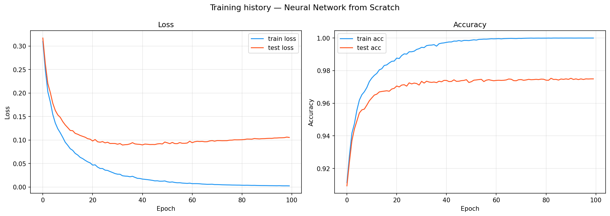

# Neural Network from Scratch

My first neural network implementation using only NumPy — no PyTorch, no TensorFlow, no shortcuts.

Built as part of learning how neural networks actually work under the hood, before moving to frameworks.

## Results

| Dataset | Accuracy |
|---------|----------|
| MNIST train | 99.99% |
| MNIST test | 97.48% |



## What I learned

- How forward propagation works (matrix multiplication, activations)
- Backpropagation and chain rule by hand
- Why weight initialization matters (He initialization)
- The difference between train and test accuracy (overfitting)
- Numerical stability tricks (`np.clip`, subtracting max before softmax)

## Architecture
Input (784) → Dense → ReLU → Dense → ReLU → Dense → Softmax → Output (10)
128              64              10

## Stack

- Python 3.11
- NumPy — everything else is built from scratch
- Matplotlib — visualizations
- scikit-learn — only for dataset loading and train/test split

## Run it

```bash
python -m venv venv_ai
venv_ai\Scripts\activate
pip install numpy matplotlib jupyter scikit-learn
jupyter notebook notebooks/mnist.ipynb
```